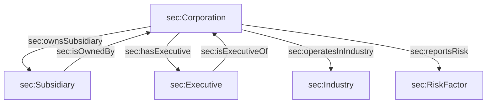

# 🏦 SEC EDGAR Subsidiary Knowledge Graph & Agentic GraphRAG System

[](https://gpham93.github.io/sec-knowledge-graph/)
[](https://python.org)
[](https://www.w3.org/OWL/)
[](https://www.w3.org/TR/shacl/)
[](https://ai.google.dev/)

An enterprise-grade **Agentic Knowledge Graph & Hybrid RAG System** built on SEC EDGAR 10-K filings. The system extracts corporate subsidiary trees, executive leadership teams, industrial classifications (SIC codes), and Item 1A risk factor profiles into a unified W3C RDF/OWL Knowledge Graph validated with SHACL constraints.

It features a **Dual-Pass Hybrid RAG Query Planner** with **Financial Domain Term Expansion** and a live interactive **Vis.js canvas assistant** hosted on [GitHub Pages](https://gpham93.github.io/sec-knowledge-graph/).

---

## 🚀 Key Architectural Features

### 1. 🏗️ Batch SEC EDGAR Extraction & Traffic Compliance
- **Multi-Ticker Ingestion**: Processes financial institutions (Goldman Sachs `GS`, JPMorgan Chase `JPM`, Morgan Stanley `MS`, Citigroup `C`, Bank of America `BAC`).
- **SEC Rate Limiting**: Enforces `EDGAR_RATE_LIMIT_PER_SEC = 9` and `1.0s` inter-request pauses to strictly adhere to SEC EDGAR traffic rules.
- **Fault-Tolerant Pipeline**: Per-ticker exception handling logs warnings for bad filings while allowing batch execution to continue.

### 2. 👥 Probabilistic Entity Resolution (Splink)
- Uses **Splink** with a **DuckDB** backend for entity resolution over raw subsidiary names.
- Configured with Levenshtein string distance matching to deduplicate and cluster spelling variations (e.g., `"Goldman Sachs & Co. LLC"` vs `"Goldman Sachs & Co LLC"`).

### 3. 🛡️ Semantic SHACL Shape Validation (`pyshacl`)
- Enforces strict data quality rules at build time via SHACL shape graphs (`sec:CorporationShape`, `sec:SubsidiaryShape`, `sec:ExecutiveShape`).
- Mandates that all corporation nodes maintain active links to `sec:operatesInIndustry` and `sec:hasExecutive`.

### 4. 🌐 Multi-Hop Corporate Ontology Model

- **Classes**: `sec:Corporation`, `sec:Subsidiary`, `sec:Executive`, `sec:Industry`, `sec:RiskFactor`.
- **Properties**: Inverse object pairs (`sec:hasExecutive`/`sec:isExecutiveOf`), datatype attributes (`sec:cik`, `sec:sic`, `sec:stateOfIncorporation`, `sec:businessAddress`, `sec:hasJurisdiction`).

### 5. 🤖 Agentic GraphRAG & Dual-Pass Query Planner
- **Schema-First Injection**: Extracts RDF schema axioms and injects formal ontologies into the LLM system prompt.
- **Dual-Pass Hybrid Execution**: Splits multi-part user prompts into parallel sub-tasks:
  - **Sub-Task A**: SPARQL / multi-hop graph traversal for structural entity links.
  - **Sub-Task B**: Vector & text retrieval over 10-K passages.
- **Financial Domain Term Expansion**: Maps colloquial search terms to official SEC EDGAR 10-K filing terminology:
  - `"supply chain"` ➔ `["third-party vendor", "outsourced service provider", "operational reliance", "cloud infrastructure risk"]`
  - `"lawsuits"` ➔ `["legal proceedings", "item 3", "contingent liabilities", "litigation"]`
  - `"executives"` ➔ `["executive officers", "board of directors", "senior leadership"]`
- **Agentic Routing & Fallbacks**: Automatically routes prompts (`DUAL_PASS_HYBRID`, `GRAPH_METADATA`, `VECTOR_TEXT`) with fallback to text search if graph queries yield 0 triples.

---

## 📁 Repository Structure

```
sec-knowledge-graph/
├── data/
│   └── sec_knowledge_graph.ttl      # Master serialized RDF Turtle graph
├── scripts/
│   ├── extract_sec_data.py          # Batch EDGAR extraction & SHACL pipeline
│   ├── agentic_graph_rag.py        # Agentic Dual-Pass GraphRAG engine & CLI
│   └── graph_rag.py                 # GraphRAG CLI entry point
├── index.qmd                        # Quarto page with Vis.js visualizer & live AI chatbot
├── styles.css                       # Glassmorphism dark mode CSS & badges
├── data_graph.ttl                   # Active RDF triplestore
├── data_graph.json                  # Graph JSON for Vis.js canvas
└── _quarto.yml                      # Quarto website configuration
```

---

## 💻 Quickstart & Local Usage

### 1. Clone & Setup Environment
```bash
git clone https://github.com/gpham93/sec-knowledge-graph.git
cd sec-knowledge-graph

python3 -m venv venv
source venv/bin/activate
pip install edgartools rdflib splink duckdb pyshacl google-genai tenacity httpx pandas
```

### 2. Run SEC Ingestion Pipeline
Extract 10-K filings, run Splink deduplication, validate SHACL rules, and generate RDF graph files:

```bash
# Default batch (GS, JPM, MS, C, BAC)
python scripts/extract_sec_data.py

# Custom ticker batch
python scripts/extract_sec_data.py --tickers GS JPM MS
```

### 3. Query via Agentic GraphRAG CLI
Set your Google Gemini API Key and run multi-hop queries:

```bash
export GEMINI_API_KEY="your_api_key_here"

python scripts/agentic_graph_rag.py --query "List the subsidiaries of Bank of America and summarize their supply chain and lawsuit risks"
```

### 4. Preview Interactive Web App Locally
```bash
quarto preview
```

---

## 🌐 Live Web App

Explore the interactive corporate knowledge graph and chat with the embedded AI assistant live at:
👉 **[https://gpham93.github.io/sec-knowledge-graph/](https://gpham93.github.io/sec-knowledge-graph/)**
