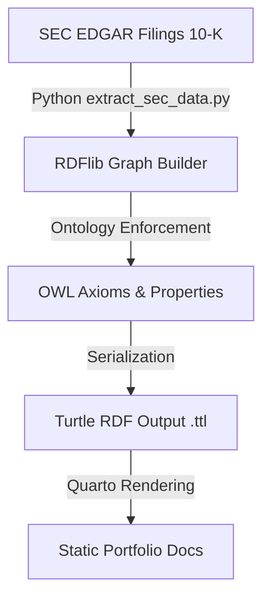

Welcome to the **SEC Corporate Subsidiary Knowledge Graph** portfolio project.

This repository hosts an automated neuro-symbolic data pipeline that extracts corporate subsidiary hierarchies from SEC EDGAR filings and maps them into a Web Ontology Language (OWL)-governed knowledge graph.

## 🌐 Interactive Subsidiary Tree
Explore the extracted corporate structure of Goldman Sachs and its subsidiaries. Drag to move, scroll to zoom, and click any node to inspect its ontology properties in the panel below.

::: {.graph-card}
### Goldman Sachs Group Inc. & Subsidiaries
<div class="mb-3">
  <span class="badge-custom badge-corp">Corporation</span>
  <span class="badge-custom badge-sub">Subsidiary</span>
</div>

<div id="network-canvas"></div>

<div id="inspector-panel" class="mt-3 p-3 rounded" style="background: rgba(255,255,255,0.03); border: 1px solid rgba(255,255,255,0.08); font-family: monospace; font-size: 0.9em;">
  <span style="color: #888;">Select a node in the graph to inspect its OWL / RDF properties...</span>
</div>
:::

<script>
document.addEventListener("DOMContentLoaded", function() {
  const container = document.getElementById('network-canvas');
  const inspector = document.getElementById('inspector-panel');
  
  // Detect theme colors
  const isDark = document.body.classList.contains('quarto-dark') || 
                 window.matchMedia('(prefers-color-scheme: dark)').matches;
  
  const textColor = isDark ? '#e2e8f0' : '#1e293b';
  
  fetch('data_graph.json')
    .then(response => response.json())
    .then(data => {
      // Style the nodes dynamically based on group
      const styledNodes = data.nodes.map(node => {
        const isCorp = node.group === 'Corporation';
        return {
          ...node, // Preserve CIK, SIC, stateOfIncorporation, businessAddress, jurisdiction, etc.
          shape: 'dot',
          size: isCorp ? 28 : 16,
          color: {
            background: isCorp ? '#e5c158' : '#00b4d8',
            border: isCorp ? '#d4af37' : '#0077b6',
            highlight: {
              background: isCorp ? '#f4d068' : '#90e0ef',
              border: isCorp ? '#e5c158' : '#00b4d8'
            }
          },
          font: {
            color: textColor,
            size: isCorp ? 15 : 12,
            face: 'Outfit, sans-serif'
          },
          borderWidth: 2
        };
      });

      const edges = data.edges.map(edge => {
        return {
          from: edge.from,
          to: edge.to,
          color: isDark ? 'rgba(255,255,255,0.15)' : 'rgba(0,0,0,0.12)',
          arrows: {
            to: { enabled: true, scaleFactor: 0.5 }
          },
          width: 1.5
        };
      });

      const graphData = {
        nodes: new vis.DataSet(styledNodes),
        edges: new vis.DataSet(edges)
      };

      const options = {
        nodes: {
          scaling: {
            label: {
              enabled: true
            }
          }
        },
        physics: {
          stabilization: {
            enabled: true,
            iterations: 150
          },
          barnesHut: {
            gravitationalConstant: -3000,
            centralGravity: 0.15,
            springLength: 120,
            springConstant: 0.04
          }
        },
        interaction: {
          hover: true,
          tooltipDelay: 200
        }
      };

      const network = new vis.Network(container, graphData, options);

      // Handle Node Clicks (Inspector)
      network.on("click", function(params) {
        if (params.nodes.length > 0) {
          const clickedNodeId = params.nodes[0];
          const nodeData = styledNodes.find(n => n.id === clickedNodeId);
          
          let detailsHtml = `
            <strong>URI:</strong> <a href="${nodeData.id}" target="_blank" style="color: #00b4d8; text-decoration: none;">${nodeData.id}</a><br>
            <strong>Name:</strong> ${nodeData.label}<br>
            <strong>OWL Class:</strong> sec:${nodeData.group}<br>
          `;
          
          if (nodeData.group === 'Corporation') {
            const formattedAddress = (nodeData.businessAddress || "").replace(/\n/g, ", ");
            detailsHtml += `
              <strong>CIK:</strong> ${nodeData.cik || 'Unknown'}<br>
              <strong>SIC Code:</strong> ${nodeData.sic || 'Unknown'} (${nodeData.sicDescription || 'Unknown'})<br>
              <strong>Incorporated In:</strong> ${nodeData.stateOfIncorporation || 'Unknown'}<br>
              <strong>Business Address:</strong> ${formattedAddress}
            `;
          } else {
            detailsHtml += `
              <strong>Jurisdiction:</strong> ${nodeData.jurisdiction || 'Unknown'}
            `;
          }
          
          inspector.innerHTML = detailsHtml;
        } else {
          inspector.innerHTML = `<span style="color: #888;">Select a node in the graph to inspect its OWL / RDF properties...</span>`;
        }
      });
    })
    .catch(err => {
      console.error("Error rendering network graph:", err);
      container.innerHTML = `<div class="p-4 text-danger">Failed to load graph data. Check console for details.</div>`;
    });
});
</script>

## 🤖 Live Graph RAG Chatbot
Ask questions about the corporate hierarchies directly in your browser. This chat interface extracts facts from the knowledge graph and grounds Gemini's answers in real time.

```{=html}
<div class="chat-card mb-4" style="padding: 0; overflow: hidden;">
  <div class="chat-container">
    <div class="chat-header">
      <span class="badge-custom badge-corp" style="font-family: 'Outfit', sans-serif;">Grounded in SEC Graph</span>
      <button id="toggle-key-btn" class="btn btn-sm btn-outline-secondary" style="font-family: 'Outfit', sans-serif; border-radius: 20px; padding: 2px 10px; font-size: 0.8rem;">⚙️ API Key</button>
    </div>
    <div id="key-panel" class="api-key-panel d-none m-3">
      <label for="gemini-key" class="form-label" style="font-size: 0.85rem; font-weight: 500;">Gemini API Key (stored locally in your browser):</label>
      <div class="input-group mb-2">
        <input type="password" id="gemini-key" class="form-control form-control-sm" placeholder="AIzaSy...">
        <button id="save-key-btn" class="btn btn-sm btn-primary">Save Key</button>
      </div>
      <small class="text-muted" style="font-size: 0.75rem;">No backend is used. Your key is sent directly to Google's Gemini API endpoint in your browser.</small>
    </div>
    <div id="chat-log" class="chat-log">
      <div class="chat-message bot">
        Hello! I am your SEC Graph RAG assistant. Ask me anything about parent companies, CIKs, SIC codes, addresses, or subsidiaries, or click one of the quick questions below:
      </div>
    </div>
    <div class="chat-input-area">
      <input type="text" id="chat-input" class="chat-input-field" placeholder="Ask about CIKs, SIC codes, addresses, or subsidiaries...">
      <button id="send-chat-btn" class="chat-send-btn" type="button" aria-label="Send query">
        <svg xmlns="http://www.w3.org/2000/svg" width="16" height="16" fill="currentColor" viewBox="0 0 16 16">
          <path d="M15.964.686a.5.5 0 0 0-.65-.65L.767 5.855H.766l-.452.18a.5.5 0 0 0-.082.887l.41.26.001.002 4.995 3.178 3.178 4.995.26.41a.5.5 0 0 0 .887-.082l.18-.452L15.963.686Zm-1.833 1.89.471-1.178-1.178.471L5.93 9.363l.338.215a.5.5 0 0 1 .154.154l.215.338 7.494-7.494Z"/>
        </svg>
      </button>
    </div>
  </div>
</div>

<div class="chat-chips mb-4">
  <button type="button" class="chip" data-prompt="What is Morgan Stanley's CIK and state of incorporation?">Morgan Stanley Info</button>
  <button type="button" class="chip" data-prompt="Which JPMorgan Chase subsidiaries are located in Germany?">JPM Germany Subs</button>
  <button type="button" class="chip" data-prompt="Are there any duplicate or clustered subsidiaries?">Deduplication Info</button>
  <button type="button" class="chip" data-prompt="What is Goldman Sachs' business address?">GS Address</button>
</div>
```

<script>
document.addEventListener("DOMContentLoaded", function() {
  const toggleKeyBtn = document.getElementById('toggle-key-btn');
  const keyPanel = document.getElementById('key-panel');
  const geminiKeyInput = document.getElementById('gemini-key');
  const saveKeyBtn = document.getElementById('save-key-btn');
  const chatLog = document.getElementById('chat-log');
  const chatInput = document.getElementById('chat-input');
  const sendChatBtn = document.getElementById('send-chat-btn');
  const chips = document.querySelectorAll('.chip');
  
  let graphDataText = "";
  
  // Safe markdown renderer helper
  function safeRenderMarkdown(text) {
    try {
      if (typeof marked !== 'undefined') {
        if (typeof marked.parse === 'function') {
          return marked.parse(text);
        } else if (typeof marked === 'function') {
          return marked(text);
        }
      }
    } catch (e) {
      console.warn("Markdown rendering error:", e);
    }
    return text.replace(/\n/g, '<br>');
  }
  
  // Fetch graph data to build our RAG grounding context
  fetch('data_graph.json')
    .then(r => r.json())
    .then(data => {
      let context = "FACTS FROM CORPORATE KNOWLEDGE GRAPH:\n";
      
      const corps = data.nodes.filter(n => n.group === 'Corporation');
      const subs = data.nodes.filter(n => n.group === 'Subsidiary');
      
      context += "PARENTS (Corporations):\n";
      corps.forEach(c => {
        const addr = (c.businessAddress || "").replace(/\n/g, ', ');
        context += `- ${c.label} (URI: ${c.id}) has CIK ${c.cik}, SIC code ${c.sic} (${c.sicDescription}), state of incorporation ${c.stateOfIncorporation}, address: ${addr}.\n`;
      });
      
      context += "\nRELATIONSHIPS (Ownership & Jurisdictions):\n";
      data.edges.forEach(e => {
        const parent = corps.find(c => c.id === e.from);
        const sub = subs.find(s => s.id === e.to);
        if (parent && sub) {
          context += `- ${parent.label} owns subsidiary ${sub.label} (URI: ${sub.id}) which is incorporated in jurisdiction: ${sub.jurisdiction}.\n`;
        }
      });
      
      graphDataText = context;
    })
    .catch(e => console.error("Error loading graph context for chatbot:", e));

  // Load key from localStorage
  if (localStorage.getItem('gemini_api_key')) {
    geminiKeyInput.value = localStorage.getItem('gemini_api_key');
  }

  // Toggle key panel
  if (toggleKeyBtn && keyPanel) {
    toggleKeyBtn.addEventListener('click', () => {
      keyPanel.classList.toggle('d-none');
    });
  }

  // Save key
  if (saveKeyBtn && geminiKeyInput) {
    saveKeyBtn.addEventListener('click', () => {
      const key = geminiKeyInput.value.trim();
      if (key) {
        localStorage.setItem('gemini_api_key', key);
        appendMessage('bot', 'API Key saved successfully! Ask me anything.');
        keyPanel.classList.add('d-none');
      } else {
        localStorage.removeItem('gemini_api_key');
        appendMessage('bot', 'API Key cleared.');
      }
    });
  }

  // Append a message to the chat UI
  function appendMessage(sender, text) {
    const msg = document.createElement('div');
    msg.className = `chat-message ${sender}`;
    msg.innerHTML = text;
    chatLog.appendChild(msg);
    chatLog.scrollTop = chatLog.scrollHeight;
    return msg;
  }

  const DEFAULT_API_KEY = "";

  // Call Gemini API
  function queryGemini(userMessage) {
    const apiKey = localStorage.getItem('gemini_api_key') || DEFAULT_API_KEY;
    if (!apiKey) {
      appendMessage('bot', '⚠️ Please configure your Gemini API Key using the ⚙️ API Key button above (or get a free 1-click key at <a href="https://aistudio.google.com/app/apikey" target="_blank" style="color: #00b4d8;">Google AI Studio</a>).');
      return;
    }

    // Append bot bubble with typing indicator
    const botBubble = appendMessage('bot', `
      <div class="typing-indicator">
        <div class="typing-dot"></div>
        <div class="typing-dot"></div>
        <div class="typing-dot"></div>
      </div>
    `);

    const prompt = `
You are an expert corporate intelligence assistant. You have access to a verified facts database derived from SEC EDGAR filings.

${graphDataText}

Based ONLY on the facts above, answer this question: "${userMessage}"

Rules:
1. Ground your answer strictly in the facts database above. If the database does not have the info, say "I cannot find this information in the SEC knowledge graph."
2. Do not assume or extrapolate.
3. Be concise and cite the parent-subsidiary relationships or metadata.
`;

    const url = `https://generativelanguage.googleapis.com/v1beta/models/gemini-2.5-flash:generateContent?key=${apiKey}`;
    
    fetch(url, {
      method: 'POST',
      headers: { 'Content-Type': 'application/json' },
      body: JSON.stringify({
        contents: [{ parts: [{ text: prompt }] }]
      })
    })
    .then(r => {
      if (!r.ok) {
        return r.json().then(err => { throw new Error(err.error.message || 'API request failed') });
      }
      return r.json();
    })
    .then(data => {
      let answer = "";
      try {
        answer = data.candidates[0].content.parts[0].text;
      } catch (err) {
        answer = "Could not parse response from Gemini API.";
      }
      botBubble.innerHTML = safeRenderMarkdown(answer);
      chatLog.scrollTop = chatLog.scrollHeight;
    })
    .catch(err => {
      console.error("Gemini API error:", err);
      botBubble.innerHTML = `<span class="text-danger">Error: ${err.message}</span>`;
      chatLog.scrollTop = chatLog.scrollHeight;
    });
  }

  // Handle messages sending
  function handleSend() {
    const text = chatInput.value.trim();
    if (!text) return;
    
    appendMessage('user', text.replace(/\n/g, '<br>'));
    chatInput.value = "";
    
    queryGemini(text);
  }

  if (sendChatBtn) {
    sendChatBtn.addEventListener('click', handleSend);
  }
  if (chatInput) {
    chatInput.addEventListener('keypress', (e) => {
      if (e.key === 'Enter') handleSend();
    });
  }

  // Event listeners for suggestion chips
  chips.forEach(chip => {
    chip.addEventListener('click', () => {
      const promptText = chip.getAttribute('data-prompt');
      if (promptText) {
        appendMessage('user', promptText);
        queryGemini(promptText);
      }
    });
  });
});
</script>

## Pipeline Architecture

The architecture consists of three core phases:

1. **Extraction**: Programmatic ingestion of SEC EDGAR filings (specifically Form 10-K) to retrieve corporate structures using `edgartools`.
2. **Knowledge Representation**: Modeling parent-subsidiary relationships into a formal Resource Description Framework (RDF) triplestore using `rdflib`.
3. **Semantic Schema (OWL)**: Enforcing logical consistency and enabling reasoner-ready inverse/functional properties (`sec:ownsSubsidiary` and `sec:isOwnedBy`).



## Ontology Definition

The pipeline binds to a custom namespace `sec` (`http://enterprise.org/ontology/sec#`) and constructs the following semantic relations:

- **Inverse Properties**: `sec:ownsSubsidiary` is defined as the inverse of `sec:isOwnedBy`.
- **Functional Property**: `sec:isOwnedBy` is defined as functional, ensuring a subsidiary has at most one parent company.
- **Classes**:
  - `sec:Corporation` for the parent entity (e.g., Goldman Sachs `GS`, Morgan Stanley `MS`, JPMorgan Chase `JPM`).
  - `sec:Subsidiary` for the subsidiary entities listed in the filing.

---

## 🤖 Graph RAG Query Engine

This project incorporates a standalone **Graph Retrieval-Augmented Generation (Graph RAG)** tool. It allows natural language questioning over the structured SEC EDGAR filing data, combining SPARQL graph traversal with LLM inference.

### How to Run Graph RAG Locally
Ensure you have your Gemini API key configured in your terminal environment, then run the query tool:

```bash
# 1. Export your API key
export GEMINI_API_KEY="your-gemini-api-key"

# 2. Run the Query Engine
python scripts/graph_rag.py --query "Which JPMorgan Chase subsidiaries are located in Germany?"
```

The script will:
1. Load [data_graph.ttl](file:///Users/gabrielpham/.gemini/antigravity-ide/scratch/sec-knowledge-graph/data_graph.ttl).
2. Feed the relevant serialized Turtle graph context into the Gemini model.
3. Generate a highly accurate, grounded answer complete with URI citations.


