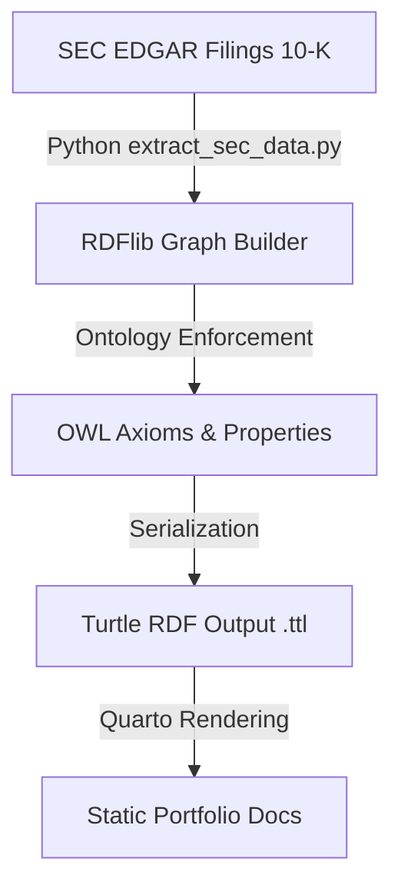

Welcome to the **SEC Corporate Subsidiary Knowledge Graph** portfolio project.

This repository hosts an automated neuro-symbolic data pipeline that extracts corporate subsidiary hierarchies from SEC EDGAR filings and maps them into a Web Ontology Language (OWL)-governed knowledge graph.

## Pipeline Architecture

The architecture consists of three core phases:

1. **Extraction**: Programmatic ingestion of SEC EDGAR filings (specifically Form 10-K) to retrieve corporate structures using `edgartools`.
2. **Knowledge Representation**: Modeling parent-subsidiary relationships into a formal Resource Description Framework (RDF) triplestore using `rdflib`.
3. **Semantic Schema (OWL)**: Enforcing logical consistency and enabling reasoner-ready inverse/functional properties (`sec:ownsSubsidiary` and `sec:isOwnedBy`).

## Ontology Definition

The pipeline binds to a custom namespace `sec` (`http://enterprise.org/ontology/sec#`) and constructs the following semantic relations:

- **Inverse Properties**: `sec:ownsSubsidiary` is defined as the inverse of `sec:isOwnedBy`.
- **Functional Property**: `sec:isOwnedBy` is defined as functional, ensuring a subsidiary has at most one parent company.
- **Classes**:
  - `sec:Corporation` for the parent entity (e.g., Goldman Sachs `GS`).
  - `sec:Subsidiary` for the subsidiary entities listed in the filing.
