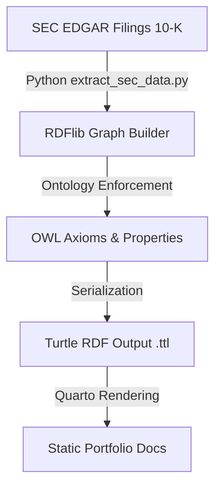

Welcome to the **SEC Corporate Subsidiary Knowledge Graph** portfolio project.

This repository hosts an automated neuro-symbolic data pipeline that extracts corporate subsidiary hierarchies from SEC EDGAR filings and maps them into a Web Ontology Language (OWL)-governed knowledge graph.

## 🌐 Interactive Subsidiary Tree
Explore the extracted corporate structure of Goldman Sachs and its subsidiaries. Drag to move, scroll to zoom, and click any node to inspect its ontology properties in the panel below.

::: {.graph-card}
### Goldman Sachs Group Inc. & Subsidiaries

  Corporation
  Subsidiary

  Select a node in the graph to inspect its OWL / RDF properties...

:::

## Pipeline Architecture

The architecture consists of three core phases:

1. **Extraction**: Programmatic ingestion of SEC EDGAR filings (specifically Form 10-K) to retrieve corporate structures using `edgartools`.
2. **Knowledge Representation**: Modeling parent-subsidiary relationships into a formal Resource Description Framework (RDF) triplestore using `rdflib`.
3. **Semantic Schema (OWL)**: Enforcing logical consistency and enabling reasoner-ready inverse/functional properties (`sec:ownsSubsidiary` and `sec:isOwnedBy`).

## Ontology Definition

The pipeline binds to a custom namespace `sec` (`http://enterprise.org/ontology/sec#`) and constructs the following semantic relations:

- **Inverse Properties**: `sec:ownsSubsidiary` is defined as the inverse of `sec:isOwnedBy`.
- **Functional Property**: `sec:isOwnedBy` is defined as functional, ensuring a subsidiary has at most one parent company.
- **Classes**:
  - `sec:Corporation` for the parent entity (e.g., Goldman Sachs `GS`).
  - `sec:Subsidiary` for the subsidiary entities listed in the filing.

